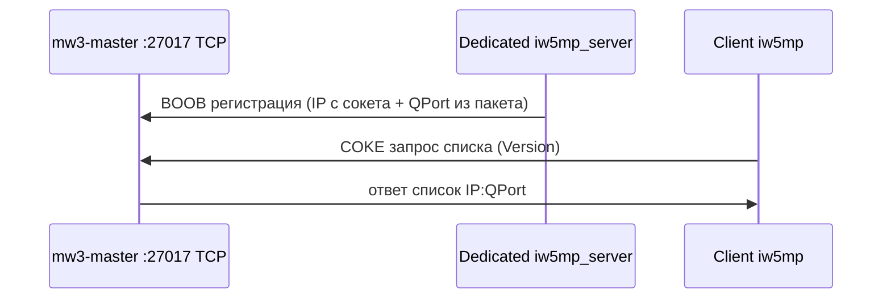
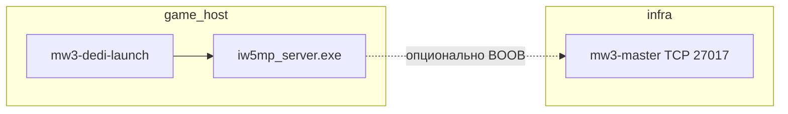
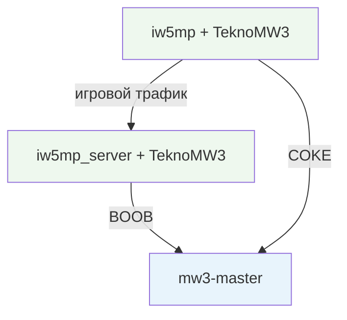

# Флоу: мастер-сервер, игровой сервер, клиент

Краткая схема для TeknoGods MW3 и Rust-утилит из `rust/`. Порты и имена файлов — типичные; у себя проверьте `teknogods.ini` и настройки мода.

---

## Как направить игру на **ваш** мастер-сервер

Игра и dedicated читают **`teknogods.ini`** из **рабочего каталога процесса** (обычно папка, откуда запущены `iw5mp.exe` / `iw5mp_server.exe`).

1. Убедитесь, что **`mw3-master`** слушает нужный интерфейс и порт (часто **`0.0.0.0:27017`** или IP машины и **`:27017`**).

2. В `teknogods.ini` добавьте или измените секцию **`[Network]`**:

```ini
[Network]
OnlineMode=true
MasterServer=192.168.0.10:27017
```

- **`OnlineMode`** по умолчанию в коде **`true`**. Если поставить **`false`**, адрес мастера из INI для **онлайн-пути** не подставляется — список через ваш сервер работать не будет.
- **`MasterServer`** — строка вида **`IPv4:порт`** или **`имя_хоста:порт`** (обязательно двоеточие и порт). Примеры: `127.0.0.1:27017`, `master.lan:27017`. Это тот же порт, на котором слушает **`mw3-master`** (не игровой `net_port` дедика).

3. Перезапустите игру / dedicated, чтобы DLL снова прочитала INI.

4. Проверка: на машине с клиентом должен открываться **исходящий TCP** к `MasterServer`. На машине с **`mw3-master`** — **входящий TCP** на этот порт (если клиенты из другой сети).

Через Rust-утилиту (из каталога с `teknogods.ini`):

```bash
mw3-loader ini-set teknogods.ini Network MasterServer 192.168.0.10:27017
mw3-loader ini-set teknogods.ini Network OnlineMode true
```

(Для `OnlineMode` значение в INI обычно задаётся как `true`/`false` в том виде, в каком его пишет игра; при ручном редактировании достаточно строк как в примере выше.)

Если строка **`MasterServer`** в неверном формате или хост не резолвится, в логе эмулятора будет сообщение о том, что не удалось выставить IP/порт мастера.

---

## 1. Мастер-сервер (`mw3-master`)

**Роль:** отдельная программа, **не** `iw5mp_server.exe`. Держит **список** зарегистрированных dedicated-серверов (по версии игры) и отдаёт его клиентам по **TCP**.

| Параметр | Обычно |
|----------|--------|
| Транспорт | TCP |
| Порт по умолчанию | **27017** |
| Регистрация сервера | Пакет **BOOB** (сервер шлёт после `accept` с своего IP) |
| Запрос списка | Пакет **COKE** (клиент) |

**Запуск (пример):**

```bash
cd rust
cargo run -p mw3-master -- --bind 0.0.0.0:27017
```

Или собранный `mw3-master.exe` с тем же `--bind`.

**Что должно быть снаружи:**

- Если мастер не на той же машине: в **`teknogods.ini`** у клиентов и у дедика (если они ходят в онлайн-список) в секции **`[Network]`** ключ **`MasterServer`** = `ваш_хост:27017` (см. `docs/CONTRACTS.md` / `rust/docs/CONTRACTS.md`).
- Файрвол: разрешить **входящий TCP 27017** на машине с `mw3-master`.

**Порядок по времени:** мастер можно поднять **до** дедика и клиентов; без него **интернет-список** серверов не обновится, но **LAN / прямое подключение** (`+server IP:порт`) может работать без мастера.



---

## 2. Игровой сервер (dedicated)

**Роль:** процесс **`iw5mp_server.exe`** — сам **мультиплеерный сервер** матча (не путать с `mw3-master`).

**Запуск на Windows через Rust-лаунчер с патчем DLL:**

1. Каталог игры: `iw5mp_server.exe`, **`TeknoMW3.dll`**, прочие файлы мода.
2. Команда (порт **игры** — например `27015`, не обязательно 27017):

```text
mw3-dedi-launch.exe iw5mp_server.exe +set dedicated 1 +set net_port 27015
```

С ключами в начале строки:

```text
mw3-dedi-launch.exe iw5mp_server.exe +usekeys +set dedicated 1 +set net_port 27015
```

`mw3-dedi-launch` создаёт процесс в suspended, подменяет в памяти строку `steam_api.dll` на имя вашей DLL, создаёт mutex `TeknoMW3…`, резюмирует поток.

**Связь с мастером:** если в конфиге игры указан **`MasterServer`**, движок/мод может **регистрироваться** на вашем `mw3-master` (BOOB). Сам `mw3-master` **не** поднимает игровой процесс.

**Порядок:** чаще всего сначала **`mw3-master`**, потом **dedicated** (или наоборот — мастер только для списка; дедик стартует и без него, но не попадёт в список).



---

## 3. Клиент (сама игра)

**Роль:** **`iw5mp.exe`** + подмена Steam API (**`TeknoMW3.dll`** и т.д. по инструкции мода).

**Варианты:**

| Сценарий | Как подключаться |
|----------|------------------|
| Через список / онлайн | Запуск `iw5mp.exe` с модом; в **`teknogods.ini`** корректный **`MasterServer`**. Клиент ходит на мастер (COKE), получает адреса серверов, подключается к выбранному. |
| LAN / прямой IP | Аргументы вида **`+server IP:порт`**, где порт — **игровой** dedicated (тот же `net_port`, не порт мастера). Rust-утилита только **печатает** строку: `mw3-loader args-client-connect IP порт` → скопировать в ярлык или bat рядом с `iw5mp.exe`. |
| Только `+usekeys` | Как в старом лаунчере для LAN-слушателя: `mw3-loader args-client-lan --usekeys` → передать в `iw5mp.exe`. |

**Rust `mw3-loader` не стартует `iw5mp.exe`** — только подсказывает argv и правит INI. Графический лаунчер — отдельно, каталог **`mw3_loader/`** в репозитории.

**Порядок для типичного «интернет + свой мастер»:**

1. Поднять **`mw3-master`** (`:27017`).
2. Прописать **`MasterServer`** всем участникам.
3. Запустить **dedicated** через **`mw3-dedi-launch`**.
4. Запустить **клиент** `iw5mp.exe` (через список или `+server`).



---

## Порты — не путать

| Сервис | Типичный порт | Протокол |
|--------|---------------|----------|
| Мастер-список (`mw3-master`) | **27017** | TCP |
| Игровой dedicated (`net_port`) | **например 27015** (любой свободный) | UDP/TCP игры |
| Проверка «жив ли сервер» (`mw3-query-cli`) | **игровой** порт dedicated | UDP |

---

См. также: [README.RU.md](../README.RU.md), [CONTRACTS.md](CONTRACTS.md) (форматы пакетов и INI).
